<div align="center">


# xx Wallet Mobile

**A mobile-first, non-custodial Progressive Web App wallet for the [xx network](https://xx.network) blockchain.**

[](LICENSE)
[](https://mobile.xx.network)
[](#tech-stack)
[](https://xx.network)
[](https://mobile.xx.network)

[**Open the wallet → mobile.xx.network**](https://mobile.xx.network)

</div>

---

xx Wallet Mobile is a focused, phone-first companion to the official desktop-first
[wallet.xx.network](https://wallet.xx.network) — the same chain and the same primitives, built
for the smaller screen. It runs entirely in your browser, holds your keys on your own device,
talks to no backend of its own, and can be installed to your home screen and used offline.

It covers the full surface a day-to-day xx network user needs from a phone: accounts, transfers,
the complete staking lifecycle (nominator **and** validator), the full Gov1 governance surface,
native multisig, Ledger hardware accounts, and private messaging over the xx mixnet — with
quantum-resistant key generation on by default.

> [!IMPORTANT]
> **Not yet official.** This is an independent, community-built wallet — not yet a formally endorsed
> or official xx network / xx Foundation product. It interacts with the public xx network chain the
> same way any wallet does.
>
> **Self-custody, your responsibility.** The wallet is non-custodial — you alone hold your keys
> and recovery phrases. There is no password reset and no way to recover lost phrases.
>
> **Not independently audited.** An internal security review has been completed and its findings
> addressed, but the code has not yet had a *third-party* audit. Treat it as experimental and use it
> at your own risk. See [Security](#security) and [`SECURITY.md`](SECURITY.md).

---

## Why xx Wallet Mobile

A few things set it apart — and they're deliberately built to add as little *new* trust as possible
on top of what xx network already provides:

- **Mobile-first, not a desktop port.** An installable PWA designed for the phone: touch-native
  flows, and it works offline once installed — new-account generation included.
- **Same chain, same foundation tools.** The wallet has no backend of its own. Keys are generated
  with the audited [xxfoundation/sleeve](https://github.com/xxfoundation/sleeve) reference; chain
  state and history come straight from the xx network RPC and the xx Foundation indexer (the same
  sources `explorer.xx.network` uses); and the auto-nominate logic is ported from the foundation's
  own [staking.xx.network](https://github.com/xxnetwork/staking.xx.network) Simple Staker. You rely
  on the same primitives the official wallet does — not a new server or homegrown cryptography. Even
  the production deployment runs on xx Foundation infrastructure (the Foundation's Cloudflare account
  and the `xx.network` domain), not a personal server.
- **You can see what you sign.** Multisig calls, governance preimages, and proposals are decoded
  locally from the on-chain bytes — never from a description someone supplied — and validators are
  inspectable before you stake.
- **Private messaging without a new server.** Coordinate a multisig or chat 1:1, end-to-end
  encrypted over the xx network's own mixnet — metadata-resistant by design, nothing stored on any
  server, and a separate unlinkable identity per account. The received data is still re-checked
  against the on-chain call hash, so a message is transport, never an instruction.
- **Quantum-resistant by default**, non-custodial, and free of telemetry, analytics, and ads — your
  keys never leave the device.

It's an independent project, not an official one (see the note above). The goal is a better phone
experience without asking you to trust anything new.

---

## Screenshots

<table>
  <tr>
    <td align="center">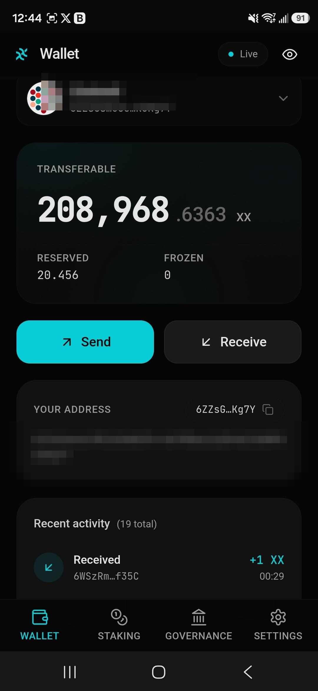<br/><sub><b>Wallet</b></sub></td>
    <td align="center">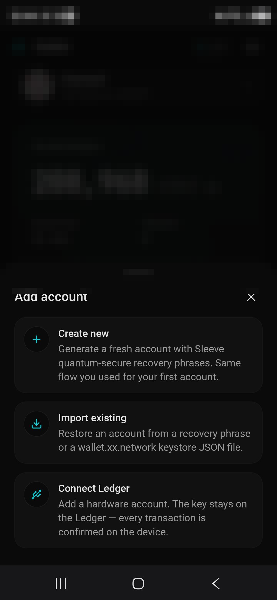<br/><sub><b>Add account &middot; Ledger</b></sub></td>
    <td align="center">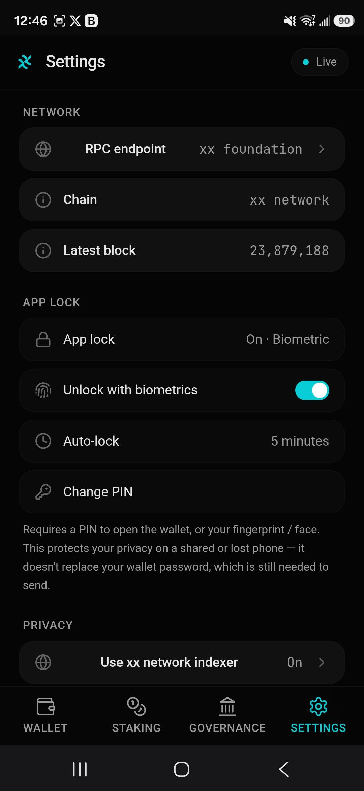<br/><sub><b>App lock &amp; privacy</b></sub></td>
  </tr>
  <tr>
    <td align="center">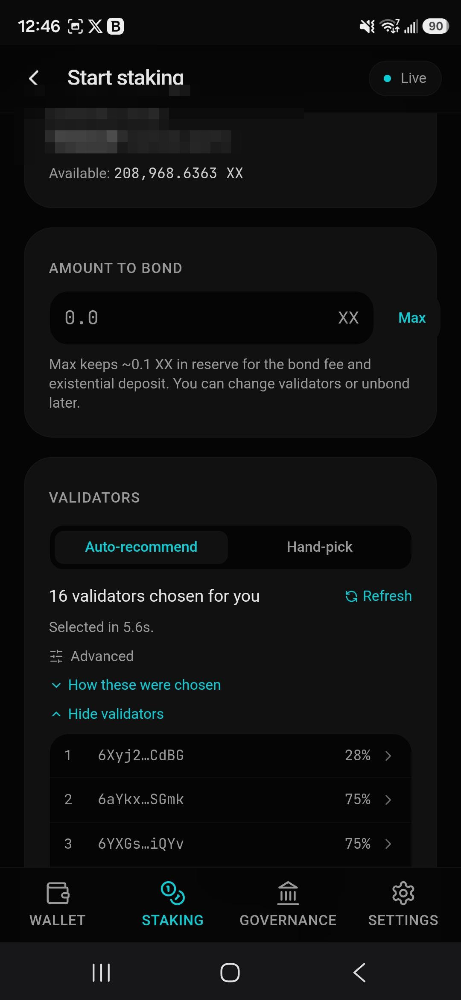<br/><sub><b>Staking &middot; nominate</b></sub></td>
    <td align="center">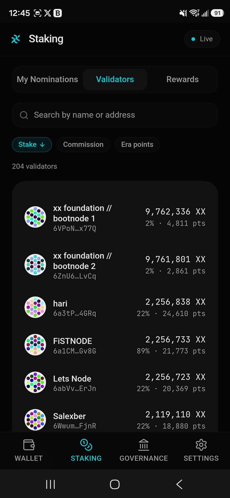<br/><sub><b>Staking &middot; validators</b></sub></td>
    <td align="center">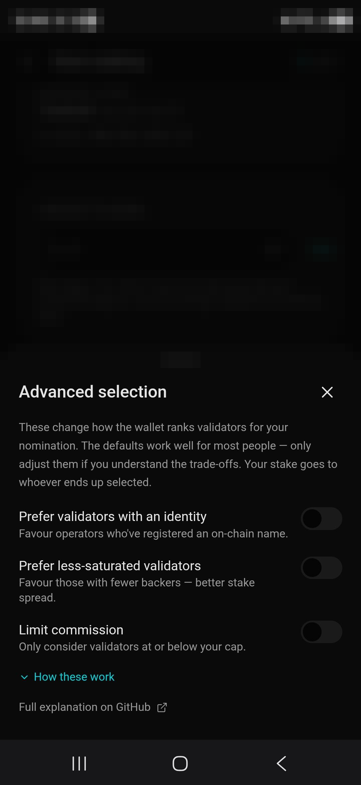<br/><sub><b>Staking &middot; tunable picks</b></sub></td>
  </tr>
  <tr>
    <td align="center">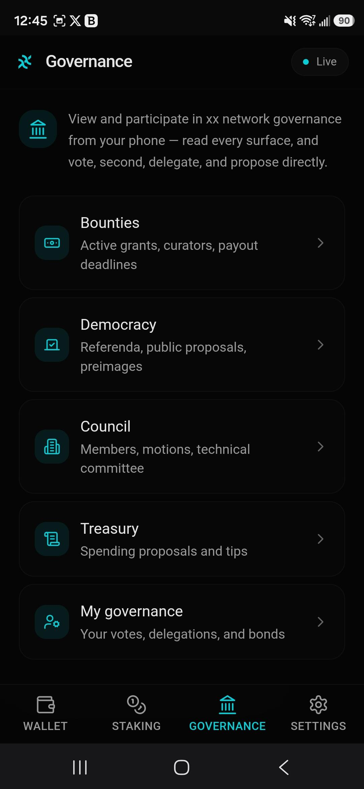<br/><sub><b>Governance</b></sub></td>
    <td align="center">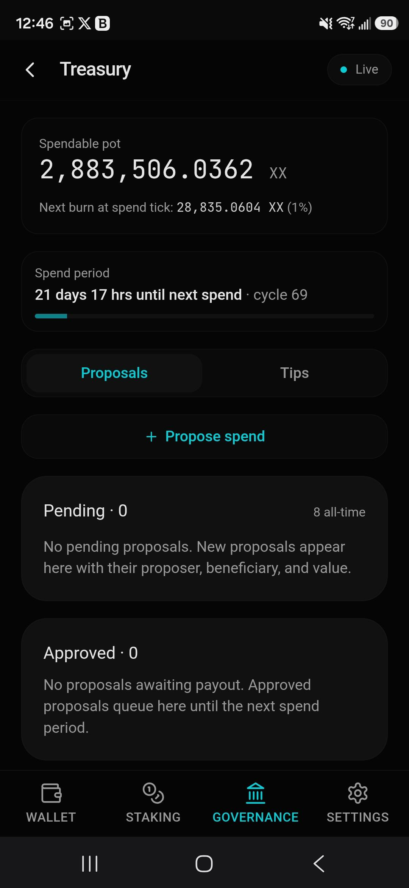<br/><sub><b>Treasury</b></sub></td>
    <td align="center">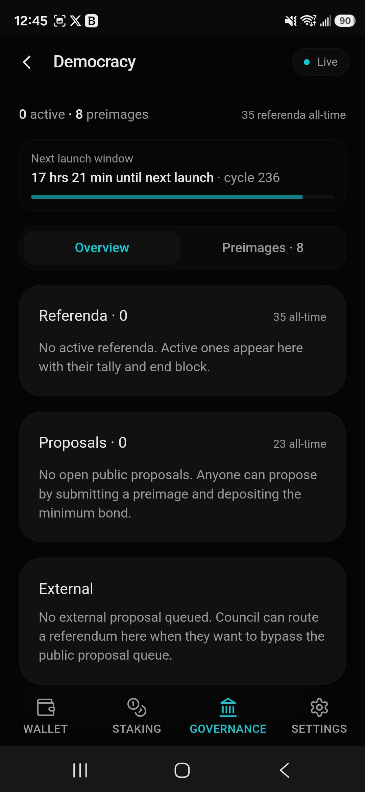<br/><sub><b>Democracy</b></sub></td>
  </tr>
  <tr>
    <td align="center">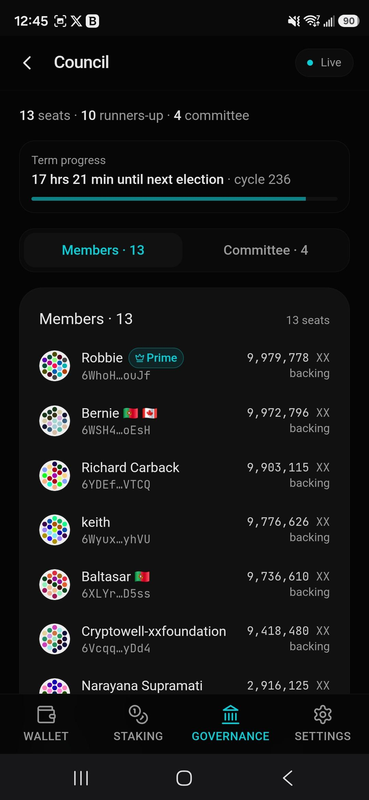<br/><sub><b>Council</b></sub></td>
    <td align="center">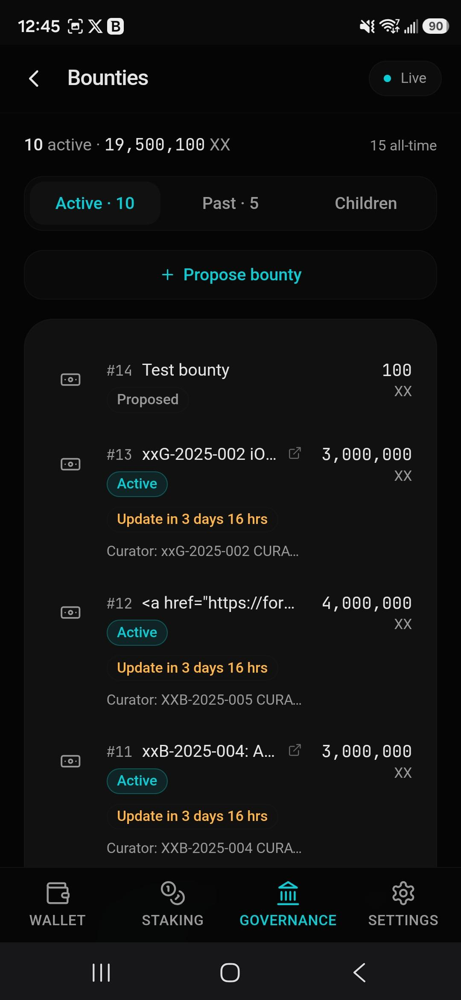<br/><sub><b>Bounties</b></sub></td>
    <td align="center">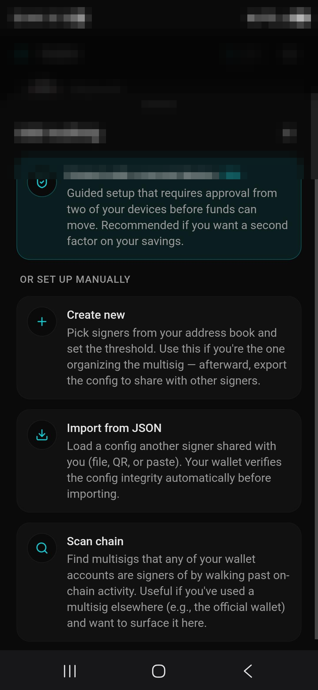<br/><sub><b>Multisig &middot; two-device 2FA</b></sub></td>
  </tr>
</table>

---

## Features

### Accounts & keys
- **Quantum-resistant by default.** New wallets are created with [Sleeve](https://sleeve.xx.network),
  which produces a standard mnemonic for everyday use plus a quantum-secure master phrase to roll
  over to once xx network adopts post-quantum identities on chain. Generation runs entirely
  in-browser with no network calls.
- **Import anything xx.** Restore from a mnemonic or from a JSON keystore — including v3 keystores
  exported by `wallet.xx.network`, which use a stronger scrypt setting that the standard libraries
  reject and this wallet handles directly.
- **Multiple accounts** with a per-account screen for the full address and QR, rename, encrypted
  export, and removal — plus a batch export that imports cleanly into the official desktop wallet.
- **Ledger hardware accounts.** Connect a Ledger (desktop Chromium, or Android over a USB cable),
  confirm the address on the device screen, and sign transfers and staking actions on the device —
  the private key never enters the browser and there's no keystore to steal. Where the Ledger xx
  network app can't decode a call (multisig, governance votes), the wallet says so instead of
  blind-signing; actions the app can't batch are split into clearly-labeled sequential approvals.

### Send & receive
- Sends use `transferKeepAlive` so you can't accidentally reap your own account, with a live
  signing → broadcasting → in-block → finalized status flow.
- A built-in address book lives right in the Send screen, with on-chain identity lookup, QR-scan to
  save a new contact, batch import/export, existential-deposit warnings, a Max button that leaves
  room for fees, and a self-send guard. Your own accounts also appear as quick recipients.
- Receive by QR or shareable address, with fallbacks that work even on plain HTTP.

### Staking
- **Nominate** in a single signature — pick validators yourself or let the built-in
  sequential-Phragmén recommender choose a balanced set from live chain state.
- **Manage** an existing position: add to your stake, change validators, or stop nominating.
- **Unbond and withdraw** with the 28-day lock surfaced up front and per-chunk countdowns.
- **Run a validator** end to end: set commission, manage your cMix node identity, and convert a
  nominating account to a validating one.
- **Stay informed**: a network-wide validator list showing identity names at a glance, per-validator
  detail with full on-chain identity and a tap-to-read points-per-era history, a personal rewards
  history, and slash alerts that give you time to react.
- **Transparent, tunable picks**: every recommended validator shows its name and commission and is
  tappable for full stats, and an optional Advanced panel lets you bias the recommendation — prefer
  validators with an on-chain identity or less-concentrated stake, or cap commission. See
  [docs/validator-selection.md](docs/validator-selection.md) for how the recommender and levers work.

### Governance
xx network runs Substrate's first-generation governance (Gov1). The wallet mirrors the official web
wallet's governance surface, consolidated for mobile:
- **Read** every surface — bounties, democracy and stored preimages, council and technical
  committee, treasury and tips, plus a personal "My Governance" dashboard.
- **Participate** — vote on referenda (with a conviction picker and live vote-power preview), second
  public proposals, delegate and undelegate voting power, remove votes, release matured locks,
  propose treasury spends, and propose bounties.
- **Verify what you sign** — preimages and proposals are decoded locally from their on-chain bytes,
  never from proposer-supplied descriptions. Addresses everywhere show a resolved name *and* a
  truncated address fragment so a friendly label can't disguise what's actually being signed.

### Multisig
- Add a multisig by manual entry, config import (file / QR / paste), or by scanning the chain for
  ones you're part of — every path re-derives the address locally and refuses a mismatch.
- Propose and approve calls with hash-gated decoding from real call bytes, share call data with
  cosigners offline (file / QR / share sheet / paste), and reclaim deposits from your own stale
  proposals. No central server is required for any of it.
- **Two-device approval** — a guided setup that turns multisig into a second factor on your funds:
  a protected account that needs approval from a second device before anything can be sent, with a
  cold backup key so losing one device doesn't lock you out. The protected-account framing follows
  the account to your other devices (via config import, a chain-scan prompt, or a manual toggle),
  and the wizard has a dedicated join path for setting up the second device. See
  [docs/two-device-approval.md](docs/two-device-approval.md).
- **Exchange-deposit caution** — sending from a multisig straight to an exchange can strand the
  deposit (the transfer is nested inside a multisig call that many exchange systems don't scan
  for), so the propose flow warns up front and asks for explicit acknowledgement when the
  recipient isn't an address the wallet recognizes.

### Security & privacy
- Non-custodial. No backend, no telemetry, no analytics, no third-party scripts.
- Keys are stored encrypted on-device and decrypted only momentarily to sign — or, for Ledger
  accounts, never exist in the browser at all.
- The Sleeve key-generation module is integrity-checked at runtime against a build-time hash.
- **Optional app lock** — an opt-in screen lock (a PIN, with fingerprint / face unlock layered on
  where the device supports it), off by default. It gates opening the app for privacy on a shared or
  lost phone; it never gates signing, which always stays behind your wallet password.
- **Indexer privacy toggle** — history, rewards, multisig activity/scan, and identity names come
  from the public xx network indexer, which (like any web service) sees your IP and the addresses
  you query. A Settings toggle turns all indexer queries off; the affected views explain what's
  missing, identity falls back to direct chain lookups, and everything that signs or moves funds
  keeps working — it never depended on the indexer.
- Ships with a Content Security Policy, HSTS, and related hardening headers.

### Installable PWA
- Add to your home screen and launch like a native app.
- The app shell — including the key-generation module — is precached, so the wallet works offline,
  account creation included.

---

## Tech stack

- **[React 18](https://react.dev) + [TypeScript](https://www.typescriptlang.org) + [Vite](https://vitejs.dev)** — app shell and build.
- **[Tailwind CSS](https://tailwindcss.com)** — styling, with custom xx network brand tokens.
- **[Zustand](https://github.com/pmndrs/zustand)** — local state, persisted for accounts, contacts, and settings.
- **[@polkadot/api](https://github.com/polkadot-js/api)** — chain interaction.
- **[vite-plugin-pwa](https://vite-pwa-org.netlify.app)** — service worker and installable shell.
- **[scrypt-js](https://github.com/ricmoo/scrypt-js) + [tweetnacl](https://github.com/dchest/tweetnacl-js)** — the `wallet.xx.network`-compatible keystore path.
- **[Sleeve](https://github.com/xxfoundation/sleeve)** — the audited xx Foundation Go reference, compiled to WebAssembly.
- **[Vitest](https://vitest.dev)** — tests, focused on the load-bearing crypto-compatibility paths.

---

## Getting started

Requires **Node 22**. (Rebuilding the Sleeve WASM additionally needs Go 1.22+, but the compiled
artifact is committed, so day-to-day development does not.)

```bash
git clone <your-fork-or-repo-url> xx-wallet
cd xx-wallet/xx-wallet-mobile

npm install
npm run dev -- --host    # dev server, reachable from a phone on the same Wi-Fi
```

Vite prints a LAN URL when it starts — open it on your phone to test the real mobile experience.

```bash
npm run typecheck        # tsc --noEmit
npm run test:run         # run the test suite once
npm run build            # production build to dist/
npm run preview -- --host
```

See [CONTRIBUTING.md](CONTRIBUTING.md) for the development workflow and conventions, and
[docs/ARCHITECTURE.md](docs/ARCHITECTURE.md) for how the codebase is laid out and why.

---

## Security

The wallet is non-custodial and runs entirely client-side: there is no server that can be breached
to take your funds, but you are responsible for your keys and recovery phrases.

[`SECURITY.md`](SECURITY.md) documents the full threat model — what the wallet protects against,
what it explicitly does not, the cryptographic primitives in use, and the deployment trust model
inherent to any browser-delivered wallet.

**Responsible disclosure:** if you find a vulnerability, please follow the process in
[`SECURITY.md`](SECURITY.md) rather than opening a public issue.

---

## Chain constants

Baked into the chain itself and defined in
[`xx-wallet-mobile/src/api/constants.ts`](xx-wallet-mobile/src/api/constants.ts):

| Item | Value |
| --- | --- |
| SS58 prefix | 55 (addresses start with "6") |
| Decimals | 9 |
| Token symbol | XX |
| Block time | 6 seconds |
| Finality | ~18 seconds (3 blocks) |
| Existential deposit | 0.001 XX |
| Default RPC | `wss://rpc.xx.network` |
| Indexer | `https://indexer.xx.network/v1/graphql` |

---

## Roadmap

Planned and under consideration, roughly in priority order:

- **Independent third-party security audit** before any recommendation for storing significant value.
- **xxCustody account support** for treasury-style locked positions.
- **Final PWA install icons** (the current ones are placeholders).
- **Upstream collaboration** with xx Foundation where the mobile work is useful to the wider ecosystem.

---

## Contributing

Contributions are welcome. Please read [CONTRIBUTING.md](CONTRIBUTING.md) first — it covers the dev
setup, coding conventions, the test expectations for security-critical code, and the PR process.
For a map of the codebase, see [docs/ARCHITECTURE.md](docs/ARCHITECTURE.md).

---

## Acknowledgements

- The [xx network](https://xx.network) and [xx Foundation](https://xx.network/about) for the chain,
  the [Sleeve](https://github.com/xxfoundation/sleeve) reference, and the
  [staking.xx.network](https://github.com/xxnetwork/staking.xx.network) Simple Staker, from which the
  validator-selection logic is ported under Apache-2.0.
- The [Polkadot-JS](https://github.com/polkadot-js) project, whose libraries make Substrate chain
  interaction possible in the browser.

---

## License

[Apache-2.0](LICENSE) — matching the main xx network wallet.
